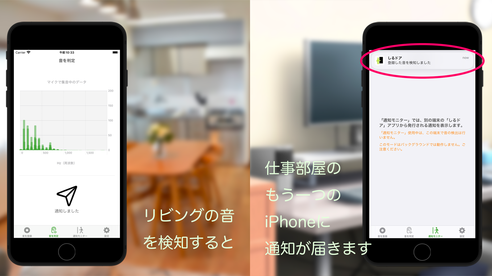
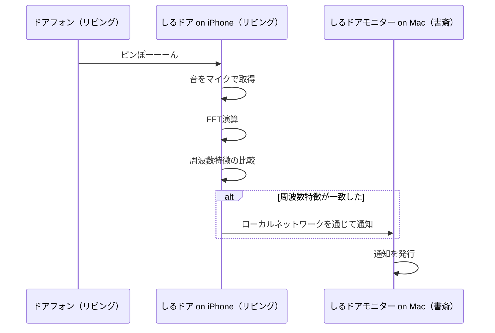
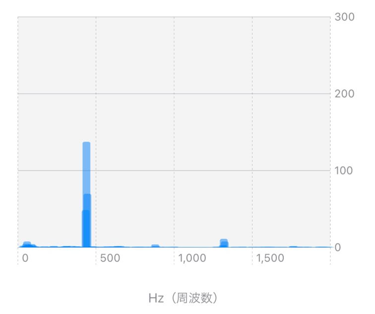

# SiruDoor


[](https://github.com/BlueEventHorizon/SiruDoor/blob/main/LICENSE)
[](https://twitter.com/k2_moons)



## 概要

**しるドア**は、iPhoneによるドアフォンの通知システムです。

在宅勤務で、例えばリビングから離れた場所で作業をしているとリビングにあるドアフォンの音が分からず配達などを受け取り損なうことはないでしょうか？

　このアプリは、iPhoneをリビングに設置し（おそらく使わなくなった古いiPhoneをお持ちの方も多いと思います）、ドアフォンの音を監視することで、ネットワークを通して別の部屋で作業中のあなたに通知を送ります。

## 構成



## 技術要素

### マイク入力の音声データを取得する

マイク入力のための資料は、あるようで実は絶望的に少なかったです。
Appleの資料だけでは、何をどう組み立てれば良いのか、ほぼ暗中模索状態でした。
開発の多くの時間は、さまざまなマイクからの音声入力に関連するライブラリやコード、資料をあたっている時間に当てられたと言っても良いでしょう。
最終的には、
https://gist.github.com/hotpaw2/ba815fc23b5d642705f2b1dedfaf0107
こちらのコードが大変参考になりました。

以下に、マイクからPCMデータを取得するための手順を説明していきます。

iOSで音を取得するためには、下記のような手順を実施する必要があります。

1. マイク入力の許可リクエスト
2. PCM入力のAVAudioSessionを開始
3. AudioUnitを設定

#### マイク入力の許可リクエスト

```swift
    private var micPermission = false

    private func requestRecordPermission(handler: @escaping ((Bool) -> Void)) {
        let audioSession = AVAudioSession.sharedInstance()

        if micPermission {
            handler(true)
        } else {
            audioSession.requestRecordPermission { (granted: Bool) in
                self.micPermission = granted
                handler(granted)
            }
        }
    }
```

#### AVAudioSessionを開始

ハードウェアのサンプリングレート（サンプリング周波数）は、44.1KHzの場合と、48KHzの場合があります。
よく知られているように、CDでのサンプリングレートは44.1kHzです。
44.1kHzは音楽業界の標準で、48kHzは映像業界の音の標準だそうです。

この数値は、人間の耳の可聴領域（人間の耳が聞きとれる音の周波数範囲）が、20Hzから20KHzであることから来ています。

サンプリングレートがおおよそ倍になっているのは、標本化定理（サンプリング定理）によるもので、20KHzまでの信号をデジタル化（サンプリング）しても情報を失わないためには、２倍以上のサンプリングレートが必要となっています。
逆に言うと、デジタル化されたデータをアナログ信号に復元する場合は、サンプリングレートの半分の周波数（これをナイキスト周波数と呼ぶ）までしか復元できません。

```swift
    let audioSession = AVAudioSession.sharedInstance()

    try audioSession.setCategory(AVAudioSession.Category.record)

    // ハードウェアのサンプリングレートを取得
    let hardwareSamplingRate = audioSession.sampleRate

    let preferredSampleRate: Double

    switch hardwareSamplingRate {
    case 48_000.0:
        preferredSampleRate = 48_000.0

    default:
        preferredSampleRate = 44_100.0
    }
    
    /*
        ハードウェアのサンプリングレートは、44.1KHzの場合と、48KHzの場合があります。
        44.1KHzの場合に、4096点のサンプリングに要する時間は、0.093秒
        48KHzの場合に、4096点のサンプリングに要する時間は、0.086秒
        となります。
    */
    let preferredIOBufferDuration: TimeInterval = 1.0 / preferredSampleRate * SoundInput.samplingNumber

    // 入力および出力オーディオサンプルレートの変更を要求
    try audioSession.setPreferredSampleRate(preferredSampleRate)
    // I/O バッファの持続時間の変更を要求
    try audioSession.setPreferredIOBufferDuration(preferredIOBufferDuration)

    sampleRate = audioSession.sampleRate

    // 割り込みの対応
    NotificationCenter.default.addObserver(
        forName: AVAudioSession.interruptionNotification,
        object: nil,
        queue: nil,
        using: myAudioSessionInterruptionHandler
    )

    try audioSession.setActive(true)
```

AVAudioSession.Categoryは、`record` です。このカテゴリは、ほぼすべての出力を無音にします。
また、ハードウェアのサンプリングレートを取得を取得し、I/O バッファの持続時間の変更を要求しています。
その後、audioSessionをアクティブにして処理を開始します。

#### AudioUnitを設定

- AudioUnitの取得
- マイク入力を有効化
- 入出力フォーマットを設定
- Bufferを確保
- 音を取得するコールバック関数を設定

##### AudioUnitの取得

最初に、AudioUnitを取得します。

「[iPhone Core Audio プログラミング](https://www.amazon.co.jp//dp/4797355158/)」によると、「AudioUnitとは、CoreAudioが持つプラグイン規格」です。

所定のAudioUnitを取り出すために、AudioComponentFindNext() 関数を用います。
AudioComponentFindNext()に渡すパラメータは下記のようになります。

```swift
    // kAudioUnitType_Output、kAudioUnitSubType_RemoteIO は、ハードウェアを意味している
    var componentDesc: AudioComponentDescription
        = AudioComponentDescription(
            componentType: OSType(kAudioUnitType_Output),
            componentSubType: OSType(kAudioUnitSubType_RemoteIO),
            componentManufacturer: OSType(kAudioUnitManufacturer_Apple),
            componentFlags: UInt32(0),
            componentFlagsMask: UInt32(0)
        )
```

kAudioUnitType_Output、kAudioUnitSubType_RemoteIO は、オーディオハードウェアを意味しており、
さらにApple製のものを指定しています。

```swift
    // 指定されたオーディオコンポーネントの次に、AudioComponentDescription 構造体に合致するコンポーネントを検索する
    // ここでは、最初に見つかったコンポーネントを返す
    let component: AudioComponent! = AudioComponentFindNext(nil, &componentDesc)

    // 新しいオーディオコンポーネントを作成
    var tempAudioUnit: AudioUnit?
    osErr = AudioComponentInstanceNew(component, &tempAudioUnit)
    audioUnit = tempAudioUnit
```

上記のように、AudioComponentから、AudioComponentInstanceであるAudioUnitを取得します。
AudioComponentはプラグインの定義であり、実際に動作させるにはAudioComponentInstanceを取得する必要があります。

iPhoneの場合は、下記のようなコードで次のハードウェアを検索してもnextComponentはnilが返ってくるので、１つのハードウェアしかないようです。

```swift
let nextComponent = AudioComponentFindNext(component, &componentDesc)
```

##### マイク入力を有効化

上記で作成した新しいオーディオコンポーネントのAudioUnitを設定していきます。

I/Oユニットのバス1は、マイクからの録音など、入力ハードウェアに接続します。
入力はデフォルトで無効になっています。
入力を有効にするには、次のようにバス1の入力スコープを有効にする必要があります。

enableFlagは 1 、UInt32型で設定します。

```swift

    private let outputBus: UInt32 = 0   // スピーカなど
    private let inputBus: UInt32 = 1    // マイクなど

    var enableFlag: UInt32 = 1

    // マイク入力を有効にする
    osErr = AudioUnitSetProperty(audioUnit,
                                kAudioOutputUnitProperty_EnableIO,
                                kAudioUnitScope_Input,
                                inputBus,
                                &enableFlag,
                                UInt32(MemoryLayout<UInt32>.size))
```

##### 入出力フォーマットを設定

入出力データフォーマットは、リニアPCM、Float型を指定します。
最終的に片チャネルしか使わないですが、一応２チャンネルステレオで取得します。

```swift
        // オーディオフォーマットの設定
        // サンプリングレート、データフォーマットとしてリニアPCM、Float型
        var streamFormatDesc: AudioStreamBasicDescription = AudioStreamBasicDescription(
            mSampleRate: Double(sampleRate),
            mFormatID: kAudioFormatLinearPCM,
            mFormatFlags: kAudioFormatFlagsNativeFloatPacked,
            mBytesPerPacket: UInt32(SoundInput.numberOfChannels * MemoryLayout<UInt32>.size),
            mFramesPerPacket: 1,
            mBytesPerFrame: UInt32(SoundInput.numberOfChannels * MemoryLayout<UInt32>.size),
            mChannelsPerFrame: UInt32(SoundInput.numberOfChannels),
            mBitsPerChannel: UInt32(8 * (MemoryLayout<UInt32>.size)),
            mReserved: UInt32(0)
        )
```

入力、出力共に同じ設定を行います。

```swift
    /// 入力フォーマットを設定
    osErr = AudioUnitSetProperty(audioUnit,
                                kAudioUnitProperty_StreamFormat,
                                kAudioUnitScope_Input,
                                outputBus,
                                &streamFormatDesc,
                                UInt32(MemoryLayout<AudioStreamBasicDescription>.size))

    /// 出力フォーマットを設定
    osErr = AudioUnitSetProperty(audioUnit,
                                kAudioUnitProperty_StreamFormat,
                                kAudioUnitScope_Output,
                                inputBus,
                                &streamFormatDesc,
                                UInt32(MemoryLayout<AudioStreamBasicDescription>.size))
```

##### Bufferを確保

AudioUnitが次に説明するコールバックのために使用する内部バッファを用意します。コールバックを持たない場合、バッファを作成する必要はありません。

enableFlagは 1 、UInt32型で設定します。

```swift
    /// Bufferを確保
    osErr = AudioUnitSetProperty(audioUnit,
                                AudioUnitPropertyID(kAudioUnitProperty_ShouldAllocateBuffer),
                                AudioUnitScope(kAudioUnitScope_Output),
                                inputBus,
                                &enableFlag,
                                UInt32(MemoryLayout<UInt32>.size))
```

##### 音を取得するコールバック関数を設定

前述のAudioUnitを設定の内容に加えて、データを取り出すためのコールバック関数を登録します。

```swift
    /// コールバック構造体
    var inputCallbackStruct
        = AURenderCallbackStruct(inputProc: recordingCallback,
                                inputProcRefCon:
                                UnsafeMutableRawPointer(Unmanaged.passUnretained(self).toOpaque()))
    /// コールバックを設定
    osErr = AudioUnitSetProperty(audioUnit,
                                AudioUnitPropertyID(kAudioOutputUnitProperty_SetInputCallback),
                                AudioUnitScope(kAudioUnitScope_Global),
                                inputBus,
                                &inputCallbackStruct,
                                UInt32(MemoryLayout<AURenderCallbackStruct>.size))
```

コールバック関数は

```swift
    /// 音を取得するコールバック関数
    let renderCallback: AURenderCallback = {
        inRefCon,  // コールバックをAudioUnitに登録する際に提供されたカスタムデータ
        ioActionFlags, // このコンテキストについて詳しく説明するためのフラグ
        inTimeStamp, // AudioUnitのレンダリングのタイムスタンプ
        inBusNumber, // AudioUnitのレンダリングのバス番号
        frameCount,  // サンプリングされたフレームの数
        _ -> OSStatus in

        let audioObject = unsafeBitCast(inRefCon, to: SoundInput.self)
        var err: OSStatus = noErr

        // set mData to nil, AudioUnitRender() should be allocating buffers
        var bufferList = AudioBufferList(
            mNumberBuffers: 1,
            mBuffers: AudioBuffer(
                mNumberChannels: UInt32(numberOfChannels),
                mDataByteSize: 16,
                mData: nil
            )
        )

        if let au = audioObject.audioUnit {
            err = AudioUnitRender(au,
                                  ioActionFlags,
                                  inTimeStamp,
                                  inBusNumber,
                                  frameCount,
                                  &bufferList)
        }

        audioObject.processMicrophoneBuffer(inputDataList: &bufferList,
                                            frameCount: UInt32(frameCount))

        return 0
    }
```

### FFT

#### FFTの概要

音の周波数を評価するために、FFTを用います。
FFTとはFast Fourier Transformation（高速フーリエ変換）[^fourier]です。
通常のフーリエ変換と異なるのは、2の累乗であるという条件を満たせば、
普通のフーリエ変換 `O(n^2)` に対し、`O(n*log n)` と高速に演算できるところです。

フーリエ変換をざっくり言うと、音も含めて時間軸と強さの軸を持つ関数は、複数の波(sin/cos）を合成したものと考えることができます。

たとえば矩形波をフーリエ変換すると、周期の異なる（奇数倍）のサイン波の合成でできていることが分かります。

人間の声は複雑な波形なので多くの波の合成からできていますが、電子機器などは単一の周波数の音を出していることが多く、
このような場合は、周波数軸から見ると下図のように特定の周波数のパワーとなって現れます。



FFTを用いることで、音を構成する周波数を比較し、同じ音であるかどうかを評価することが容易になります。

周波数の分解能は、AVAudioSessionの項で出てきたサンプル数に依存しています。
サンプリングレートが、44.1KHzでサンプル数が4096であるということは、周波数分解能は10.8Hzです。

```text
  10.8Hz = 44.1KHz / 4096
```

10.8Hz単位で音のパワーを取得できると言うことです。サンプル数を増加させれば分解能は上がっていきますが、FFTの演算時間を考慮する必要があります。

#### 窓関数

FFTでは連続した波の一部分を切り取って演算します。このため切り取った区間の端の連続性が問題になり、周波数分析結果に影響を与えます。
これに対する解決策として、窓関数[^mado]を適用して両端の不連続性を低減することができます。

窓関数には、何種類かあるのですがここでは、ハミング窓を使っています。

```math
    w(t) = 0.54 - 0.4 cos 2\pi \frac{t}{T} \ , 0 \leq t < T
```

サンプル数が4096と言うことは、データが格納された `[Float]` 配列に対して、 `T = 4096, t = 配列のindex` となります。

#### vDSP

このFFT演算では、iOS 14から利用可能になったvDSP.FFTを利用しています。

vDSPフレームワークは、フーリエ変換や二次フィルタリングなどのデジタル信号処理、また乗加算などの関数や、和、平均、最大値などの縮小関数など演算処理が高速に可能です。

vDSP.FFTは、`UnsafeMutablePointer`を使って直接メモリーにアクセスします。
入出力は複素数の形になっていますが、入力は虚数部を０として与えます。

```swift
// vDSP.FFTインスタンスを生成する

let log2n = vDSP_Length(log2(Float(signal.count)) + 1)
let fft = vDSP.FFT(log2n: log2n, radix: .radix2
                         , ofType: DSPSplitComplex.self)!

var signalArray = [Float](signal)

// UnsafeMutablePointerでメモリーをアロケート、初期化

let signalImagPtr = UnsafeMutablePointer<Float>
                      .allocate(capacity: signal.count)
signalImagPtr.initialize(to: 0)

let outputRealPtr = UnsafeMutablePointer<Float>
                      .allocate(capacity: signal.count)
outputRealPtr.initialize(to: 0)

let outputImagPtr = UnsafeMutablePointer<Float>
                      .allocate(capacity: signal.count)
outputImagPtr.initialize(to: 0)

// FFTを実行

signalArray.withUnsafeMutableBufferPointer { signalPtr in
    let input = DSPSplitComplex(realp: signalPtr.baseAddress!,
                                imagp: signalImagPtr)
    var output = DSPSplitComplex(realp: outputRealPtr, 
                                 imagp: outputImagPtr)

    fft.forward(input: input, output: &output)
}
```

演算結果は複素数で取得しますので、下記のようにパワーを演算して評価します。

```swift
let power = sqrt(pow(value.real, 2) 
                                 + pow(value.imaginary, 2))
```

今回は、FFTの演算は、「[[Swift] vDSPを利用して高速フーリエ変換する](https://zenn.dev/moutend/articles/e39f4f162db475bea8c8)」[^vdsp]を参考にさせていただきました。ありがとうございます。


### 周波数特徴の認識

今回は、単純にパワーが大きい周波数が事前に登録した周波数と一致するかどうかで評価、判定しています。
### SwiftUI Chart

FFTの結果は、iOS16から導入されたSwiftUIのChart機能を用いて描画しています。
ChartはMetalと呼ばれるハードウェアアクセラレーションを用いており、音のFFTの結果のように非常に早い周期で更新されるグラフを表示することができます。
### ローカルネットワークの通信

[MultipeerConnectivity](https://developer.apple.com/documentation/multipeerconnectivity)フレームワークを用いています。
インターネットではなく、ローカルのネットワーク環境で、対象となる通信相手を見つけ、データを送信、受信することができます。
### Mac用の通知アプリ

作りました。詳細は別途。

[^mado]: 窓関数（まどかんすう、英: window function）とは、ある有限区間（台）以外で0となる関数である。 ある関数や信号（データ）に窓関数が掛け合わせられると、区間外は0になり、有限区間内だけが残るので、無限回の計算が不要になり数値解析が容易になる。窓関数は、データから成分を抽出するアルゴリズムの中核に当たり、スペクトル分析、フィルタ・デザインや、音声圧縮に応用される。窓関数を単に窓 (window) ともいい、データに窓関数を掛け合わせることを窓を掛ける (windowing) という。理論的に最良の結果が得られるSinc関数を利用するフィルタは無限回の計算（現実には不可能）を必要とするが、フィルタを有限回の計算だけで実現するために、周波数分解能とダイナミックレンジのトレードオフの中で様々な窓関数が考案されている。
https://ja.wikipedia.org/wiki/窓関数 より

[^vdsp]: [Swift] vDSPを利用して高速フーリエ変換する（https://zenn.dev/moutend/articles/e39f4f162db475bea8c8）

 [^gist]: 【github:gist】hotpaw2/RecordAudio.swift (https://gist.github.com/hotpaw2/ba815fc23b5d642705f2b1dedfaf0107)

 [^fourier]: 工学においては、変換後の関数f'はもとの関数fに含まれる周波数を記述していると考え、しばしばもとの関数fの周波数領域表現 (frequency domain representation) と呼ばれる。言い換えれば、フーリエ変換は関数fを正弦波・余弦波に分解するとも言える。 (https://ja.wikipedia.org/wiki/フーリエ変換)より
